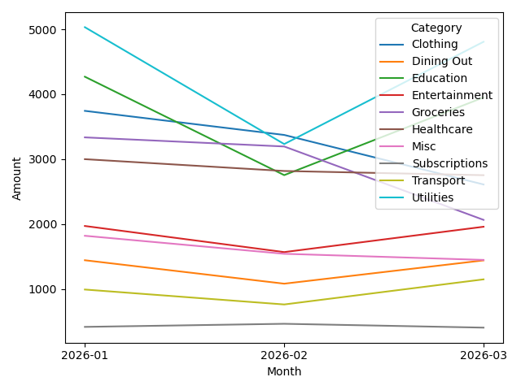

# Personal Finance Tracker

## Project Overview
This project analyzes personal spending habits using Python. 
It processes transaction data, identifies spending trends, and provides insights to improve budgeting and savings.

## Tools & Technologies
- Python
- pandas
- numpy
- matplotlib
- seaborn

## Dataset
The dataset contains 1,000 financial transactions including:
- Date: Transaction date
- Category: Spending category
- Description: Merchant/item
- Amount: Expense in USD

#1 Data Loading

Transaction data was imported into Python using pandas.

2 Data Cleaning

Steps performed:

Converted date column to datetime format

Converted amount to numeric

Removed duplicate transactions

Filled missing categories

3 Data Transformation

A Month column was created to analyze spending trends over time.

4 Pivot Table Analysis

Pivot tables were used to summarize spending by category and month.

5 Data Visualization

Charts were created to understand financial patterns:

Monthly spending by category

Category distribution

Spending trends over time

6 Insights & Findings

Key observations:

Utilities and education had the highest expenses.

Dining out and entertainment had frequent smaller transactions.

Spending patterns varied across months.

7 Savings Recommendations

Based on the analysis:

Reduce dining out expenses

Review subscription services

Set category-based monthly budgets
## Example Visualizations

## Key Skills Demonstrated
- Data Cleaning
- Pivot Tables
- Data Visualization
- Financial Trend Analysis

## Author
Komalpreet kaur
